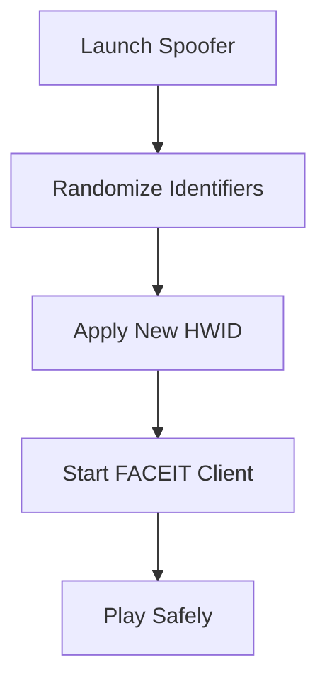

# FACEIT HWID Spoofer Tool 🛡

If you’ve ever faced a hardware ban on FACEIT, you know how restrictive it can be. The **FACEIT HWID Spoofer Tool** is designed to give you a fresh start by masking your system identifiers, letting you play without restrictions. With simple installation and robust security, this tool is trusted by competitive players worldwide.

---

## ⚡ Overview

The FACEIT HWID Spoofer changes or hides your PC’s unique hardware identifiers (disk serials, MAC addresses, BIOS, GPU, etc.) so that FACEIT’s anti-cheat system cannot link you to past bans. It’s lightweight, undetectable, and works seamlessly in the background.

\[!IMPORTANT]
Using this tool does not modify your gameplay mechanics—it only protects your hardware identity.

---

## 🔑 Features

* Instant HWID reset with one click.
* Automatic spoofing on startup for zero downtime.
* Works with **Windows 10 & Windows 11**.
* Covers multiple hardware IDs: CPU, GPU, RAM, drives, MAC, and registry keys.
* Randomization engine for unique spoofing each session.
* Undetectable by FACEIT’s kernel-level anti-cheat.

---

## 🖥 Compatibility

| Platform   | Supported Versions | Notes           |
| ---------- | ------------------ | --------------- |
| Windows 10 | 20H2 – Latest      | Fully supported |
| Windows 11 | All builds         | Fully supported |
| Linux      | ❌                  | Not available   |
| macOS      | ❌                  | Not available   |

\[!NOTE]
Administrator rights are required for the tool to function.

---

## ⚙ Setup & Usage

1. Download the FACEIT HWID Spoofer package.
2. Extract and run the installer as **Administrator**.
3. Reboot your PC to apply initial spoof.
4. Launch the tool before starting FACEIT Client.
5. Click **“Randomize HWID”** for a new identity.

---

## 📊 Workflow Diagram

---

## ❓ FAQ

**Q1: Is this tool detectable by FACEIT?**
No, it operates at kernel level with randomized identifiers, staying invisible to FACEIT.

**Q2: Do I need to spoof every time I play?**
Recommended yes—fresh HWIDs lower ban risk significantly.

**Q3: Can this unban my account?**
No, it prevents hardware bans. For account bans, you’ll need a new FACEIT account.

**Q4: Does it affect system performance?**
Not at all. It runs lightweight processes only during spoofing.

**Q5: How often are updates released?**
Weekly patches ensure compatibility with FACEIT’s latest updates.

---

## 🚀 Final Thoughts

The **FACEIT HWID Spoofer Tool** is the most reliable way to bypass hardware bans and protect your system identity. Whether you’re returning to competitive play or simply want to safeguard your account, this software ensures you’re covered.

---
